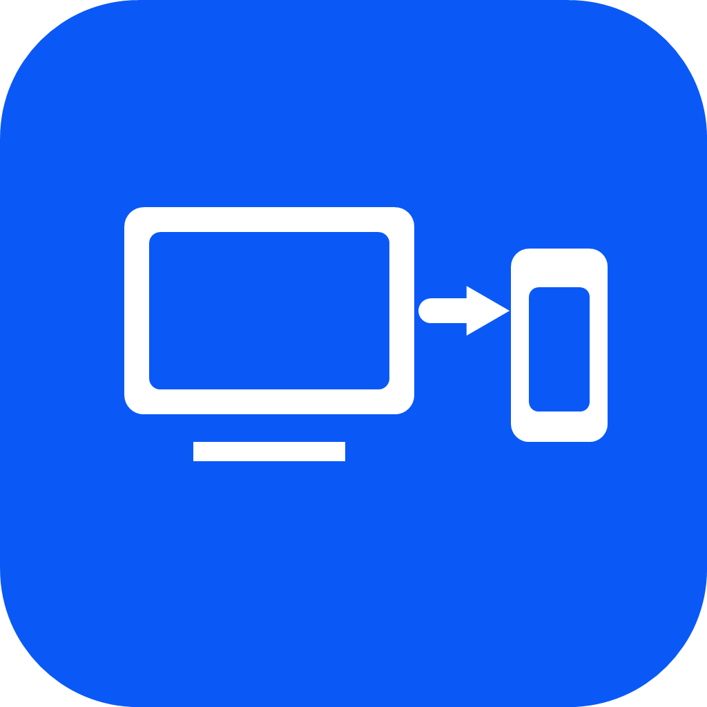

# FlowDesk

**Account-free, zero-dependency LAN remote desktop** — Scan QR, connect instantly.

<p align="center">
  
</p>

## Features

- **QR Code Pairing** — Scan PC's QR code, enter 6-digit PIN to connect
- **End-to-End Encryption** — ECDH P-256 key exchange + AES-256-GCM encryption, no server sees your data
- **Real-time Screen** — PC screen streamed to phone via UDP, ~30fps
- **Touch Control** — Phone touch maps to mouse (left/right click, scroll wheel)
- **Chinese Input** — Type directly from phone's system keyboard, synced in real-time
- **Screenshot** — Save current screen to phone gallery with one tap

## Architecture

```
┌──────────────┐     UDP (encrypted)  ┌──────────────┐
│  HarmonyOS   │◄────────────────────►│  Windows PC  │
│   Phone App  │   ECDH + AES-GCM    │   Server     │
└──────────────┘                      └──────────────┘
      Scan QR to pair. No accounts. No internet required.
```

- **Transport:** UDP (port 47800 discovery / 47801 data)
- **Encryption:** ECDH P-256 key agreement → AES-256-GCM for all data
- **Serverless:** Pure LAN P2P, no cloud services needed

## Quick Start

### PC (Windows)

1. Download `FlowDesk.exe` from [Latest Release](https://github.com/kirk2023/flowdesk/releases)
2. Run it — tray icon appears
3. Interface shows device ID and QR code

### Phone (HarmonyOS 6)

1. Open `FlowDeskHarmony/` in DevEco Studio
2. Build & Install to device
3. Open app → Tap `+` → Scan PC's QR code
4. Enter the 6-digit PIN shown on PC

## Project Structure

```
flowdesk/
├── FlowDeskHarmony/          # HarmonyOS 6 phone app (ArkTS)
│   └── entry/src/main/ets/
│       ├── pages/
│       │   ├── Index.ets         # Device list
│       │   └── RemoteScreen.ets  # Remote desktop
│       ├── services/
│       │   ├── ConnectionService.ets  # UDP connection + encryption
│       │   ├── CryptoService.ets      # ECDH + AES-GCM
│       │   ├── DiscoveryService.ets   # UDP LAN discovery
│       │   └── InputService.ets       # Touch/keyboard events
│       └── models/
│           └── Protocol.ets      # Protocol definitions
├── FlowDeskServer/           # Windows PC server (.NET 8 C#)
│   └── FlowDeskServer/
│       ├── Services/
│       │   ├── PairingService.cs       # Pairing + data transport
│       │   ├── ScreenStreamService.cs  # Screen capture + JPEG
│       │   ├── InputInjectionService.cs # Input simulation
│       │   ├── DiscoveryService.cs     # UDP broadcast discovery
│       │   └── FirewallService.cs      # Firewall rules
│       ├── Common/
│       │   └── Constants.cs            # Configuration
│       └── Models/
│           └── Protocol.cs             # Protocol models
└── README.md
```

## How It Works

### Pairing Flow

```
Phone                                    PC
  │                                      │
  │──── whoami (UDP broadcast) ─────────►│
  │◄─── iam (device info reply) ────────│
  │                                      │
  │  [Scan QR to get PC address + ID]   │
  │                                      │
  │──── PHEL (ECDH pubkey + PIN) ──────►│
  │◄─── POK! (ECDH pubkey + screen) ───│
  │                                      │
  │  [Both derive shared key via ECDH]  │
  │  [All subsequent data AES-GCM enc]  │
  │                                      │
  │◄──── PCRY (encrypted screen) ──────│
  │──── PCRY (encrypted input) ─────────►│
```

### Encryption

- **Key Exchange:** ECDH P-256, raw shared secret first 32 bytes as AES key
- **Data Encryption:** AES-256-GCM, nonce(12) || ciphertext || authTag(16)
- **Frame Chunking:** Large frames auto-chunked at 50KB, supports out-of-order reassembly

## Limitations

- LAN only — phone and PC must be on the same network
- Phone controls PC only (not bidirectional)
- Standard AES-256-GCM (not Chinese national crypto)

## Development

- **PC:** Windows 10+ / .NET 8 / C#
- **Phone:** HarmonyOS 6.0+ / DevEco Studio 5.0+ / ArkTS
- **Build:**
  - PC: `dotnet publish -c Release -r win-x64 --self-contained`
  - Phone: DevEco Studio → Build → Build Hap(s)

## Roadmap

- [x] v1.0 — LAN P2P remote desktop
- [ ] v1.1 — NAT Traversal (cross-network)
- [ ] v1.2 — File transfer
- [ ] v1.3 — Multi-device support

## License

MIT
